# 1.区块链技术起源

**分布式系统**：弱中心化是区块链思想的核心；

**P2P网络**：为区块链提供了网络层基础架构；

**共识算法**：区块链技术的核心，实现了数据的一致存储；

**密码学**：为区块链数据的传输和访问安全性，完整性和无法抵赖性提供了技术支撑；

**分布式数据库**：区块链的物理载体；

**智能合约**：为区块链应用提供了无限可能；

**电子现金**：最近几十年来的解决方案为区块链研发提供基础；

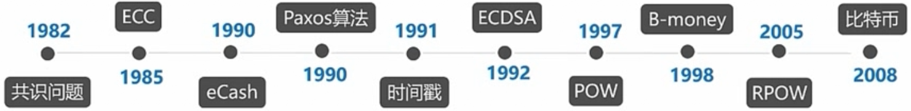

# 2.比特币产生背景

## 2.1.先行货币体系的问题

政府信用担保发行：货币滥发贬值；

银行体系提供金融服务：金融危机；

## 2.2.比特币起源

中本聪（可能不是一个人，也可能也是一个人）在2008年提出比特币：一种点对点的电子现金系统；

总共将发行2100万个比特币，目前已生成1600万个，总市场规模在1400+亿美元左右；

迄今为止最成功的区块链应用，十多年来没有出现过一次服务暂停现象，任何交易均可被追溯，但是交易者却是匿名的；

## 2.3.电子货币和数字货币对比

|              |      电子货币      |    民间数字货币    |
| :----------: | :----------------: | :----------------: |
| **定价属性** |   以主权货币计价   |  以其自身价值计价  |
| **价值属性** |  受到货币政策影响  |     由供需决定     |
|   **发行**   |        央行        |        算法        |
|   **记账**   |      多个账本      |      单个账本      |
|   **流通**   | 信息流和资金流分离 | 信息流和资金流合一 |
| **具体案例** |  微信支付，支付宝  |       比特币       |

# 3.区块链技术

## 3.1.区块链技术演进

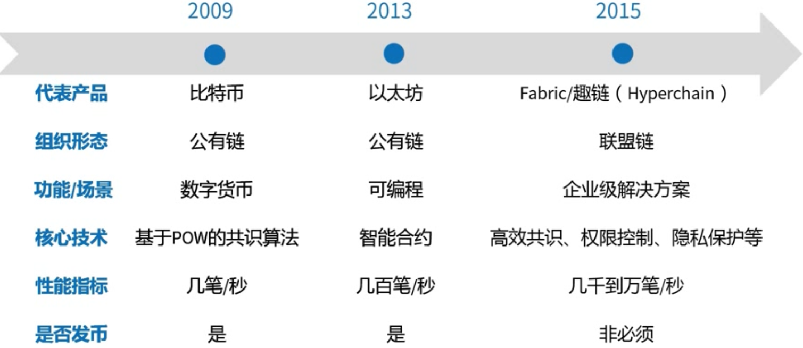

## 3.2.区块链的三种形态

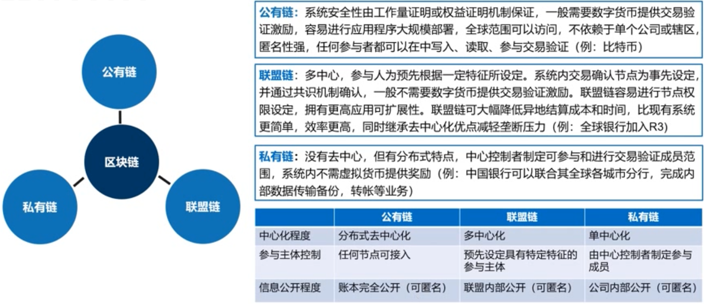

## 3.3.区块链定义

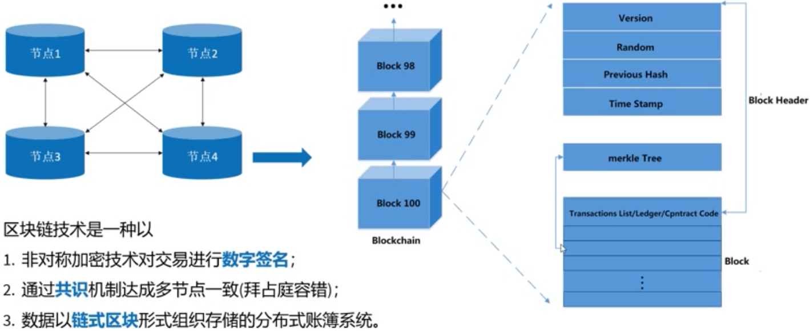

## 3.4.区块链三大特征

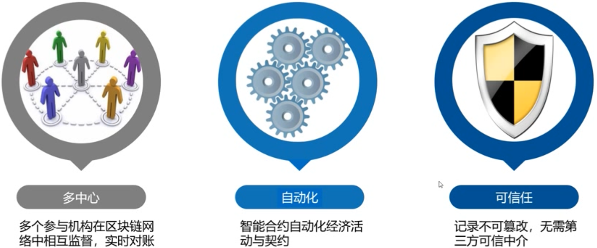

## 3.5.智能合约

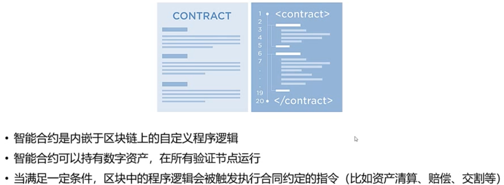

## 3.6.区块链技术架构

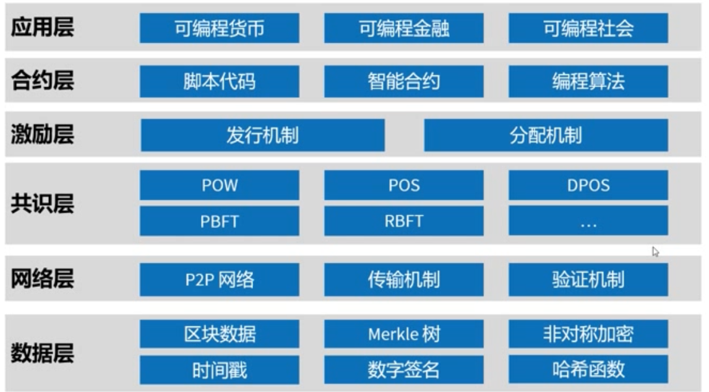

**共识层：**

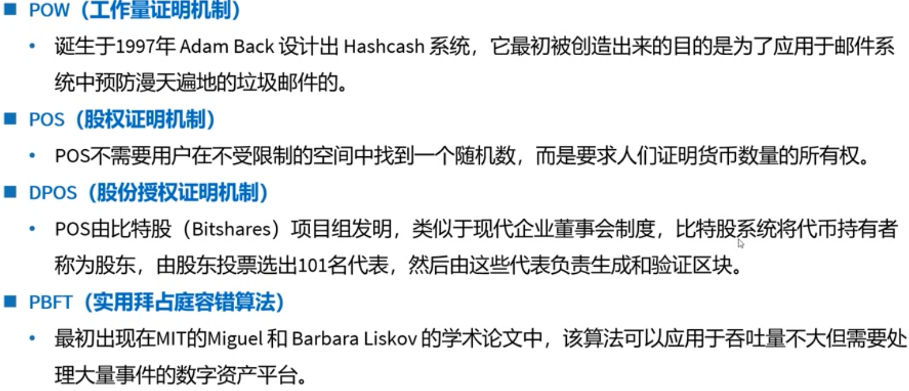

## 3.7.区块链技术社区

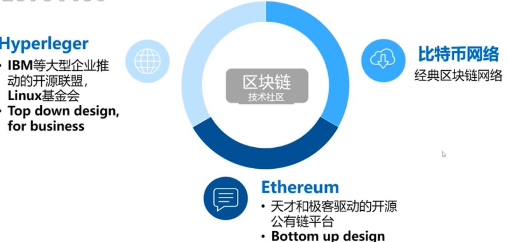

# 3.Hyperledger

## 3.1.Hyperledger社区

超级账本（Hyperledger）是首个面向企业应用场景的分布式账本平台，包括了：IBM、Intel、Cisco、DAH、摩根大通、R3等在内的众多科技和金融巨头的贡献参与，在银行，供应链等领域得到了广泛的关注和发展，目前已经拥有超过200家企业成员；

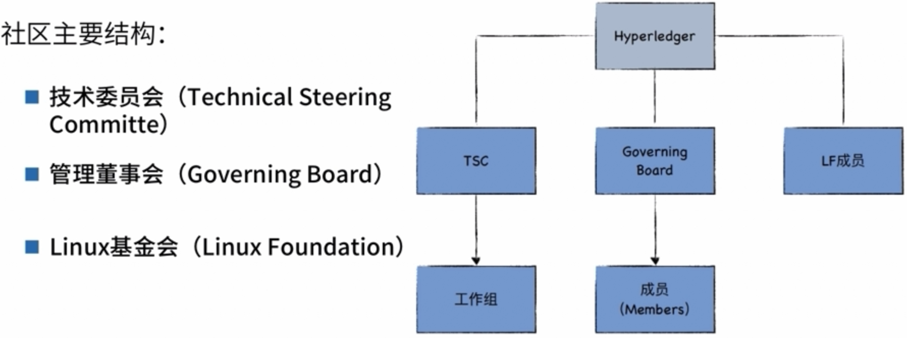

## 3.2.Hyperledger项目

2015年12月，由开源世界的旗舰组织Linux基金会牵头，30家初始企业成员共同宣布 Hyperledger联合项目成立。

成立之初，IBM贡献了4万多行已有的 OpenBlockchain 代码，DigitalAsset则贡献了企业和开发者相关资源，R3 贡献了新的金融交易架构，Intel也贡献了分布式账本相关的代码。

作为一个联合项目，旗下由面向不同的场景的子项目构成:包括==**Fabric**==、Sawtooth、lroha、Blockchain Explorer、 Cello、Indy、 Composer、 Burrow等8大顶级项目。

所有项目都遵循 Apache v2 许可，并约定共同遵守如下的基本原则：

- 重视模块化设计：包括交易、合同、一致性、身份、存储等技术场景；
- 重视代码可读性：保障新功能和模块都可以很容易添加和扩展；
- 可持续的演化路线：随着需求的深入和更多的应用场景，不断增加和演化新的项目；

**Hyperledger Sawtooth** 是一个创建、部署和运行分布式账本的模块化平台。它包含一个 新奇的共识算法，叫做经历时间证明 (Proof of ElapsedTime，简写POET)，面向大型分布式验证器群，消耗最少的资源。

**Hyperledger Iroha** 是为了将分布式账本技术简单容易地与基础架构型项目集成而设计的一个区块链框架项目。

**Hyperledger Indy** 是特别为去中心化的身份而建立的一种分布式账本。它提供了基于区块链或者其它分布式账本互操作来创建和使用独立数字身份的工具、代码库和可以重用的组件。

**Hyperledger Burrow** 是一个支持许可的智能合约机，burrow提供了一个模块化的区块链客户端，带一个经许可的智能合约解释器，它部分建立在以太坊虚拟机(EVM)规范的基础上。

**Hyperledger Fabric** 是一个带有准入机制的企业级联盟链项目，它的前身是IBM贡献的OpenBlockchain。

## 3.3.社区工作流

在社区开发过程中，需要了解一下社区写作过程中所需要使用的工具：

- Linux Foundation ID
- Jira--任务和进度管理
- Gerrit--代码仓库和Review管理
- RocketChat--在线沟通

安装环境：推荐在Linux或者MacoS环境中开发Hyperledger 项目代码。

- Git：用来从Gerrit仓库获取代码并进行版本管理
- Golang：配置Golang运行环境
- 用来支持容器环境Docker；

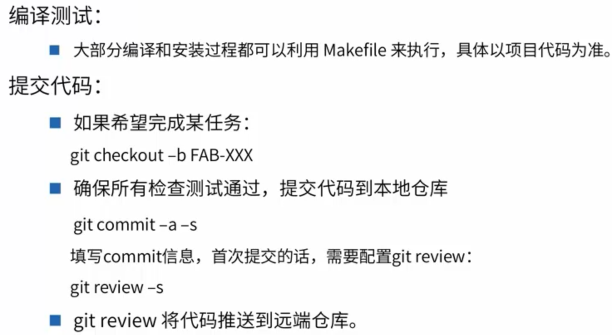

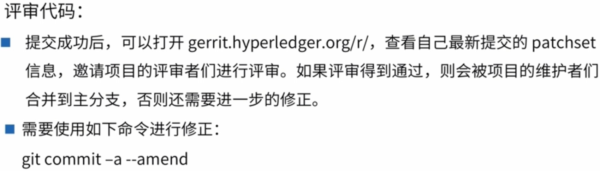

# 4.Fabric

## 4.1.Fabric介绍

Hyperledger Fabric是一个提供分布式账本解决方案的平台。HyperledgerFabric由模块化架构支撑，并具备极佳的保密性、可伸缩性、灵活性和可扩展性。

Hyperledger Fabric被设计成支持不同的模块组件直接拔插启用，并能适应在经济生态系统中错综复杂的各种场景。

## 4.2.Fabirc应用场景

商业积分，利用区块链多方发行扩大参与者、使积分自由流通，吸引用户再次消费。

跨境支付与结算，减少机构之间的信任成本，降低手续费。

数据存证，版权保护，鉴别数据真伪。

## 4.3.Fabric名词解释

**成员服务 (Membership Services)**，成员服务用来在许可的区块链网络上认证、授权和管理身份。

**排序或者共识服务(Ordering Service)** ，确认交易并将交易排序放入block。

**账本 (Ledger)** ，交易状态的持久化。

**节点 (Node)**，一个网络实体用来维护Ledger，执行合约的容器。

**SDK**，用来和区块链网络进行交互。

## 4.4.Fabric基础架构

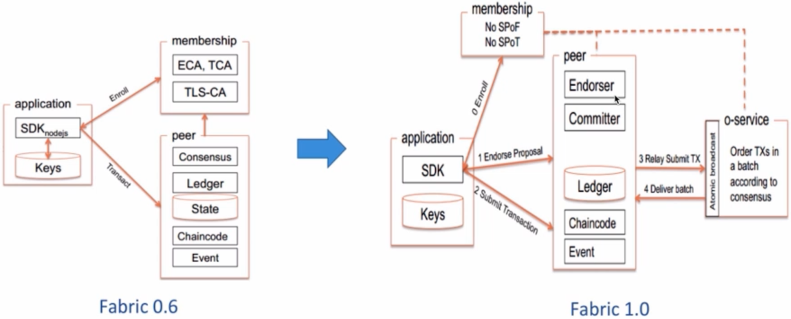

**Fabric1.X的架构优势**

链码(Chaincode) 执行信任的可伸缩性，将用户自己开发的链码和系统提供的Order服务拆分，用户开发的链码和系统提供的Order服务不再是一一对应的关系，Order也可以适当容忍错误的出现，增强了系统的鲁棒性；

性能提升，拆分链码和Order的串行执行，在原有架构中，当链码执行非常耗时的时候，Order将会处于闲置状态，不利于提高系统的吞吐量，拆分以后链码和Order可以并行执行发送交易；

共识机制可以单独实现(Order)；

## 4.5.Fabric交易流程

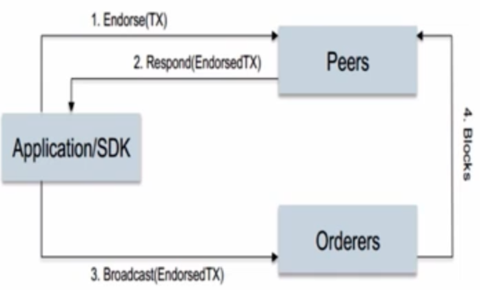

应用向单个或多个Peer节点发送对交易的背书请求；

背书节点执 ChainCode，但并不将结果提交到本地账本，只是将结果返回给应；

应收集所有背书节点的结果后，将结果播给Orderer;

Order执共识过程，并成Block，通过消息通道批量的将Block发布给Peer节点；

各个Peer节点验证交易，并提交到本地账本中。